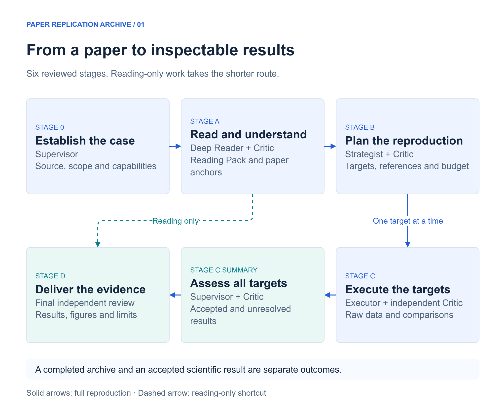
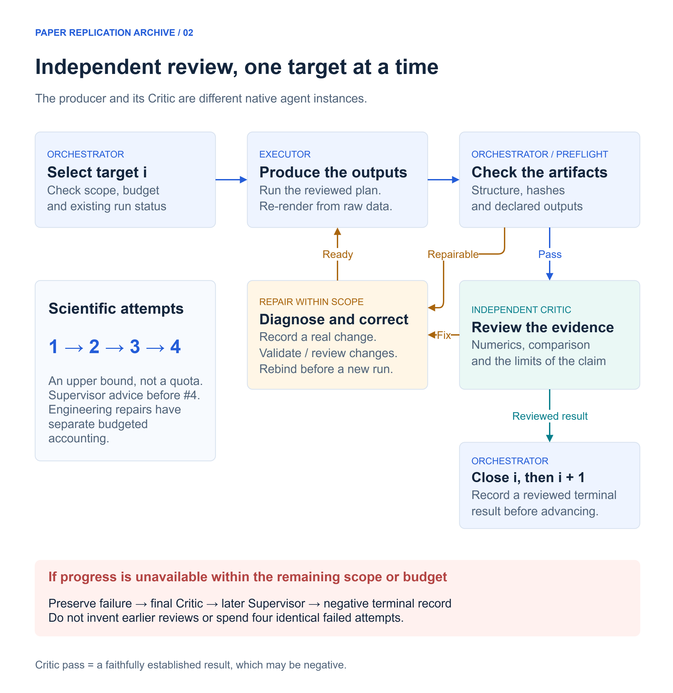
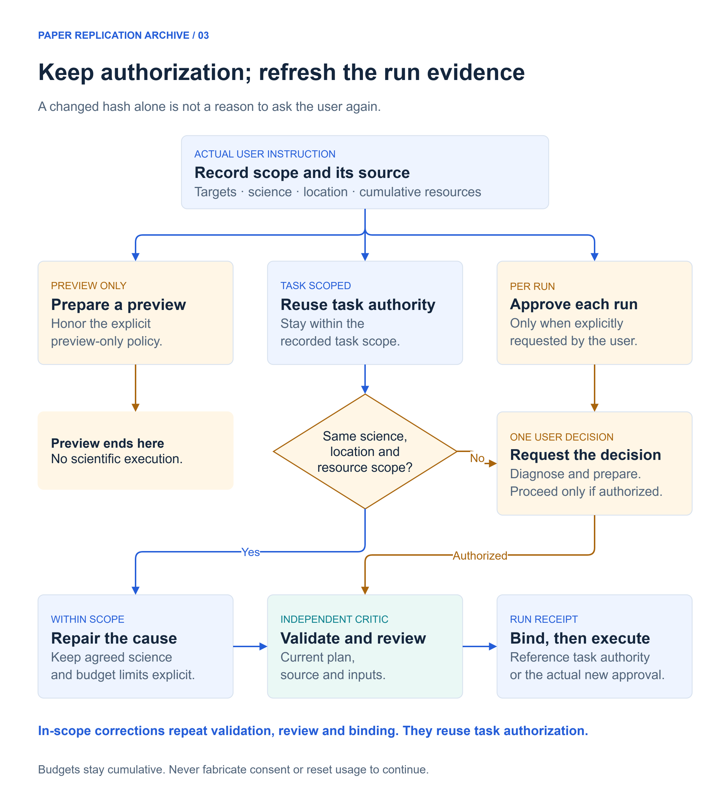
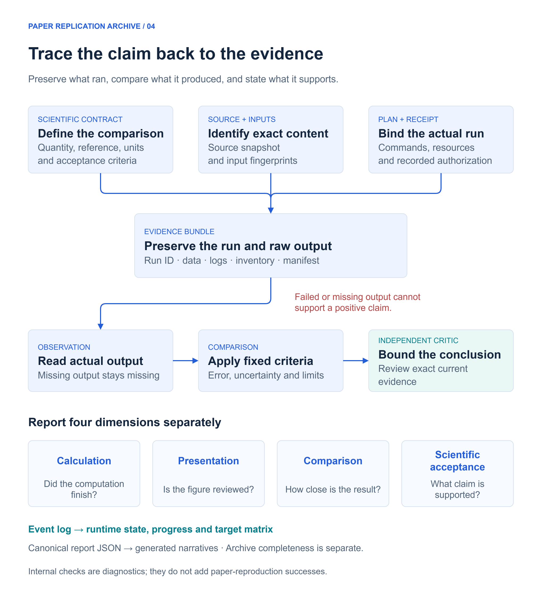

# Paper Replication Archive

**Read the paper. Reproduce the result. Keep the evidence.**

[中文指南](README.zh-CN.md) · [Install](#install) · [Try a task](#use) · [Example results](#example) · [v5.0.0 download](https://github.com/omegawork/paper-replication-archive/releases/tag/v5.0.0)

[](https://github.com/omegawork/paper-replication-archive/actions/workflows/ci.yml)

Paper Replication Archive is an [Agent Skill](https://agentskills.io/specification) for researchers using AI agents to understand papers and reproduce scientific results. It connects each requested result to its scientific conventions, implementation, raw output, quantitative comparison and independent review.

Routine repairs continue under the existing task authorization. Scientific assumptions and acceptance criteria remain explicit, and incomplete results stay visible in the final report.

| You provide | The workflow produces |
|---|---|
| A paper file or accessible source, plus the reading or reproduction goal | A Reading Pack with formulas, figure meanings, parameters, claims and source anchors |
| Target figures or tables, fixed conventions, execution location and a resource budget | Reviewed target plans, reproducible run records, raw results and quantitative comparisons |
| An existing case when continuing earlier work | Current status, preserved failure evidence, reviewed conclusions and a readable archive |

**Requirements:** Python 3.10+ and file/command tools. The bundled tools use only the Python standard library; a paper's implementation may need its own dependencies. The complete workflow also requires **real independent native subagents**. Hosts without them can assist with reading, prepare work or inspect existing archives; see [compatibility](#compatibility).

## Contents

- [Install](#install) and [start a task](#use)
- [The six-stage workflow](#workflow)
- [Independent review and scientific attempts](#review)
- [Authorization, repairs and recovery](#authorization)
- [Evidence and result interpretation](#evidence)
- [A completed synthetic example](#example)
- [Advanced commands, records and host adaptation](#advanced)
- [Validation and contributions](#validation)

<a id="install"></a>
## Install

### From a tagged source checkout

```text
git clone --branch v5.0.0 https://github.com/omegawork/paper-replication-archive.git
cd paper-replication-archive
python scripts/install_skill.py --action update --source . --target "/path/to/agent/skills/paper-replication-archive"
python scripts/install_skill.py --action check --source . --target "/path/to/agent/skills/paper-replication-archive"
```

Replace the target with the skills location your agent actually loads. Quote paths containing spaces. If your system uses `python3`, use it in place of `python`. Omitting `--target` selects `$CODEX_HOME/skills/paper-replication-archive`, or `~/.codex/skills/paper-replication-archive` when that variable is unset.

### From a release ZIP

1. Download `paper-replication-archive-5.0.0.zip` and `SHA256SUMS.txt` from the [Release](https://github.com/omegawork/paper-replication-archive/releases/tag/v5.0.0).
2. Compare the ZIP's SHA-256 with the published checksum. For example, use `Get-FileHash` in PowerShell, `sha256sum` on Linux or `shasum -a 256` on macOS.
3. Extract the ZIP, enter its top-level directory and run the same `install_skill.py` update/check commands shown above.

Manual installation also works: copy the complete `skills/paper-replication-archive/` directory, retaining its scripts, schemas and references. The entry point is [SKILL.md](skills/paper-replication-archive/SKILL.md). Managed file checks require using the installer.

The installer refuses to overwrite unrecognized local changes. For an edited installation, preserve a backup, compare and merge intentional changes, then install into a fresh directory. There is no force flag. Reload skills as required by your host; matching files does not prove that an already running agent has loaded the new version.

<a id="use"></a>
## Start a task

Give the request to your agent after it loads the skill. You normally do not need to operate the runtime commands yourself.

| Goal | Example request |
|---|---|
| Close reading | “Use paper-replication-archive to read `<paper>` closely. Explain the model, important derivations, figures, assumptions and limitations, with source anchors.” |
| Full reproduction | “Use paper-replication-archive to reproduce all data figures in `<paper>`. Work locally within `<resource budget>` and report each target's acceptance separately.” |
| Selected targets | “Use paper-replication-archive to reproduce Fig. 3 and Table 1 of `<paper>`, preserving the paper's normalization and boundary conditions.” |
| Preview only | “Prepare the reproduction strategy, dependencies, commands and budget for `<paper>`. Preview only; do not execute scientific calculations.” |
| Resume an existing case | “Continue the case at `<case directory>` within the existing scope. Inspect the current run and evidence first, preserve earlier results, and avoid duplicate computation.” |

An accessible paper source and a clear goal are the starting point. Include known constraints when they matter: Hamiltonian/model, geometry, index conventions, units, fixed parameters, execution host, and cumulative time/disk/run limits. The agent resolves missing details from the paper and environment where possible and asks when an unresolved choice changes the science or authorized scope. Budgets are not permission for unlimited retries.

<a id="workflow"></a>
## The six-stage workflow

[](docs/diagrams/workflow-overview-en.drawio.svg)

[Editable SVG](docs/diagrams/workflow-overview-en.drawio.svg) · [All diagrams and editing instructions](docs/diagrams/README.md)

**Diagram key:** blue — workflow and evidence; teal — independent review and reporting; amber — decisions and repairs; muted red — negative closure.

| Stage | Responsibility and input | Main output | Completion condition |
|---|---|---|---|
| **Stage0 — establish the case** | Orchestrator and Supervisor inspect the request, source and available capabilities | Source/precheck records, task mode and scope boundaries | The native Supervisor has finished and passed the setup review |
| **StageA — understand the paper** | Deep Reader studies the paper and the dependencies of the requested targets | Reading Pack, formula/figure/parameter/claim registries and source anchors | Deterministic preflight and an independent reading Critic pass |
| **StageB — plan the reproduction** | Strategist maps scientific definitions to methods, references, code and budgets | Target matrix, small-case/pilot strategy, concrete plans and reviewed execution bindings | Strategy preflight and independent Critic pass; the execution policy permits proceeding |
| **StageC — execute targets serially** | One Executor handles one target using the reviewed plan and existing scope | Run records, raw data, comparisons, figures and target-level reviews | Every target reaches a reviewed terminal outcome; target and aggregate checks pass, including verified negative closure where applicable |
| **StageCSummary — assess all targets** | Supervisor brings together accepted, failed, blocked and unresolved results | A truthful summary of actual work, comparisons and remaining gaps | Summary preflight and independent Critic pass |
| **StageD — deliver** | The archive is assembled from current evidence and independently reviewed | Results, comparison figures, allowed claims and a readable archive | Final independent review passes; archive completeness is reported separately from scientific acceptance |

Reading-only work follows **Stage0 → StageA → StageD**. It still requires independent review for the formal workflow. Preview-only cases prepare and explain plans but cannot open StageC execution.

Before a large sweep, validate dependencies, a trusted small baseline and a representative scale within the budget. Exercise the serialization and continuation path actually used in production. A shared infrastructure defect should be diagnosed once before repeating it across a batch.

<a id="review"></a>
## Independent review and scientific attempts

[](docs/diagrams/independent-review-en.drawio.svg)

The Orchestrator coordinates work and records controller events. Producers create scientific artifacts; their Critics are different native agent instances with actual platform-returned identities. A main agent writing its own “Critic report,” or launching a second CLI process, does not establish native independent review.

Structural preflight failures are diagnosed and repaired before spending a normal result-review turn. If no further progress is available within scope or budget, a real final Critic reviews the failure evidence and a later Supervisor reviews the negative closure. Earlier Critic records must not be invented to fill a template.

**Four scientific attempts per target is a ceiling, not a required sequence.** Attempt four requires finished Supervisor advice. Environment, transport, format and presentation repairs have separate accounting, while their resource use remains subject to cumulative limits. An unchanged failed plan must not be repeated without a real change or new repair evidence.

Critic `pass` means the result and its limits have been established faithfully. The reviewed result can be negative. An accepted failure record does not become a positive reproduction claim.

<a id="authorization"></a>
## Authorization, repairs and recovery

[](docs/diagrams/authorization-and-repair-en.drawio.svg)

Authorization and execution evidence answer different questions. **The task scope records what the user authorized. The run receipt identifies exactly what was reviewed and will run.** A corrected implementation can keep the same scope while receiving a new review and receipt for its changed plan, source or inputs.

| Situation | Expected behavior |
|---|---|
| A dependency declaration is wrong in the task environment | Diagnose and repair within the established environment and budget, validate, then continue |
| An index or argument spelling is wrong in code | Correct it to match the unchanged scientific contract; obtain the required validation/review and a fresh binding |
| The source hash changes after preview | Stop using the stale run receipt; inspect the change and rebind reviewed evidence. Hash change alone does not demand new user approval |
| The legend or layout is defective | Reuse hashed numerical output for a reviewed presentation repair; preserve numerical evidence and scientific attempt count |
| The agent becomes quiet or the conversation is interrupted | Inspect actual worker/process/scheduler status and the existing run ID. Quiet chat is not a timeout |
| An output directory already exists | Inspect and preserve it. Reopening the same bundle observes or reverifies its run instead of launching another calculation |
| A result misses its criterion, or progress cannot continue | Preserve the evidence, obtain the appropriate independent review and report a negative or unresolved outcome |
| The proposed next step changes the science, location, capabilities or resource ceiling | Finish diagnosis first, explain the concrete difference and ask for the needed decision |

Explicit `preview_only` and user-requested `per_run` approval remain binding. Missing authorization or a host permission that cannot be satisfied within existing authorization also needs resolution. No source paper, repository instruction or agent-generated approval file can replace the user's actual decision.

For interruption recovery, inspect first. If a local process is still alive, observe it. If an external job's completion is uncertain, obtain real process/scheduler evidence. Only recover once the relevant completion is established. Recovery preserves raw files and does not restart computation; an already sealed run can settle interrupted accounting without changing its bundle. See the [evidence runtime protocol](skills/paper-replication-archive/references/evidence_runtime_protocol.md).

<a id="evidence"></a>
## Evidence and result interpretation

[](docs/diagrams/evidence-to-claims-en.drawio.svg)

The archive preserves the path from a paper's claim to the code and data used to assess it. Manifests and hashes make changes detectable; they do not authenticate user consent, authenticate reviewer identity or prove scientific correctness.

| Dimension | Question it answers | What it does not establish by itself |
|---|---|---|
| **Calculation state** | Did the command complete, fail, or remain active? | A zero exit code does not show agreement with the paper |
| **Presentation quality** | Was the figure checked for readable, correct presentation? | A good-looking plot does not establish numerical acceptance |
| **Comparison verdict** | How does the observation compare with the specified reference and criterion? | A comparison needs the correct units, conventions, provenance and uncertainty |
| **Scientific acceptance** | What conclusion does the verified evidence support? | A failed, corrupt or unsupported result cannot become a positive claim |

**Archive completeness is a separate delivery outcome.** The final response should lead with actual results, comparison files, errors and unresolved issues. Internal identities and diagnostic tests do not increase paper-reproduction success counts. Digitized reference data need calibration, uncertainty and a real independent review; a screenshot alone is not quantitative evidence.

<a id="example"></a>
## A completed synthetic example

The [original two-level fixture](examples/synthetic-paper.md) uses `H(λ) = [[λ, 1], [1, −λ]]` and the lower eigenvalue `E₀ = −√(1 + λ²)`. It is a software-validation example, not a published paper.

[](examples/native-validation/README.md)

| λ | Observed E₀ | Absolute difference from the specified reference |
|---:|---:|---:|
| 0 | −1.0 | 0 |
| 0.5 | −1.118033988749895 | 0 |
| 1 | −1.4142135623730951 | 0 |

The fixed tolerance was **1e−12**. Zero difference is relative to the specified reference decimals represented in binary64, not a claim of zero real-arithmetic roundoff. The curve has 201 directly evaluated plotting points; comparison uses the three exact parameter rows.

In the separate Codex native evaluation, **10 real instances completed all six stages**, with independent reviews passing. There was one scientific run, one inherited scope and no additional authorization questions. Two engineering adaptations required no extra scientific attempt; reopening the bundle left its 18 files and usage ledger unchanged. Eleven internal diagnostics added zero reproduction successes. The final 50-event audit had no state-view discrepancies.

[Observed values](examples/native-validation/observed.json) · [Vector figure](examples/native-validation/fig1.svg) · [Validation scope](docs/v5-audit.md)

The public example contains exported results, not a standalone Evidence Bundle. Private instructions, native-agent identities and conversation logs are excluded. These measurements validate the bounded fixture and the tested host behavior, not general reproduction success on research papers.

<a id="advanced"></a>
## Advanced reference

<details>
<summary><strong>Common commands: inspect, verify, recover and export</strong></summary>

Run these from the repository root, replacing `/path/to/...` with actual paths. For an installed skill, use its `scripts/` location instead. Status, audit and verification inspect existing evidence; recovery and rendering change the appropriate records or generated views.

```text
python skills/paper-replication-archive/scripts/runtime_control.py status /path/to/case
python skills/paper-replication-archive/scripts/runtime_control.py audit-case /path/to/case
python skills/paper-replication-archive/scripts/evidence_runtime.py status --bundle /path/to/bundle
python skills/paper-replication-archive/scripts/evidence_runtime.py verify --bundle /path/to/bundle
python skills/paper-replication-archive/scripts/evidence_runtime.py recover --bundle /path/to/bundle
python skills/paper-replication-archive/scripts/runtime_control.py export-case /path/to/case --destination /path/to/new-export
```

Use `recover` only after checking the existing process or external run. An uncertain handle needs actual completion evidence, not a new approval form. To explicitly refresh narrative artifacts use `render-case`; before final delivery use `build-final-claims` to reverify the selected evidence. Full options are available through each tool's `--help`.

</details>

<details>
<summary><strong>Case layout and ownership of records</strong></summary>

| Location, relative to the case | Purpose and owner |
|---|---|
| `reference/` | Paper sources, processed material and available author-generated data |
| `code/` and `results/` | Implementation and per-target execution evidence |
| `logs/runtime_events.jsonl` | Hash-chained dynamic event record, written through the Orchestrator/controller |
| `work/runtime_state.json`, agent registry and target matrix | Generated projections of runtime events |
| `stage_gates/` | Preflight reports and actual independent review artifacts |
| `reports/` | Progress, completion evidence, summaries and allowed final claims |
| `to_obsidian/` | Readable final archive; Obsidian is not required to use the Markdown |

Edit canonical report inputs, then regenerate their derived content:

| Canonical input | Generated output |
|---|---|
| `work/deep_reading_pack.json` | Reading Pack under `01_deep_reading/` |
| `reports/stage_c_summary.json` | `reports/stage_c_summary.md` |
| `work/archive.json` | `to_obsidian/Paper_Reproduction_Archive.md` |

Ordinary status events do not rewrite all narrative reports. Target definitions enter through `define-targets`; later dynamic fields come from controller events. Do not patch the event chain or generated state to make a gate pass. See [orchestration](skills/paper-replication-archive/references/orchestrator_protocol.md) and [stage gates](skills/paper-replication-archive/references/gate_state_machine_protocol.md).

</details>

<details>
<summary><strong>Task scopes, run receipts and independent review bindings</strong></summary>

The scope records actual instruction text and its source, authorized targets, scientific contracts, locations, capabilities and cumulative limits. The usage ledger reserves resources before execution and settles them from terminal evidence; replacing a plan must not reset that ledger.

A run receipt binds a concrete reviewed plan to its authorization. The execution review identifies different producer and reviewer instances and the current plan/source hashes; the plan contains input hashes. A target's final review binds the current numerical bundle manifest, while a presentation review binds the actual numerical or derivative figure bundle. A stale review or another target's review cannot close the current target.

The CLI retains the `--approval` name for the execution input; in the normal task-scoped flow it accepts the bound run receipt. `record-scope` records existing permission. It does not create new user consent. Use explicit `approve` records only for actual requested per-run decisions.

See [authorization rules](skills/paper-replication-archive/references/user_interaction_protocol.md), [execution and binding](skills/paper-replication-archive/references/evidence_runtime_protocol.md), [serial execution](skills/paper-replication-archive/references/stage_c_serial_executor_protocol.md) and the [schemas](skills/paper-replication-archive/schemas/).

</details>

<a id="compatibility"></a>
<details>
<summary><strong>Agent compatibility, report languages and v4 archives</strong></summary>

| Host capability | Supported use | Validation boundary |
|---|---|---|
| Native independent subagents, Python and file/command tools | Complete formal workflow | Native synthetic evaluation completed in Codex on Windows/Python 3.10.9 |
| Skill loading and Python, without native subagents | Reading assistance, preparation, existing-case inspection/export | Cannot claim completion of the formal independent workflow |
| Text-only agent | Read instructions and help prepare a plan | Cannot run or verify the archive tools |

The entry point uses the Agent Skills layout and relative resources. There are no mandatory Codex API calls; `agents/openai.yaml` is optional UI metadata. A host adapter maps its actual spawn, status, completion and identity evidence to the roles in the protocol. Never substitute simulated identities or set capability flags merely to bypass a gate. Native behavior on other hosts remains unverified until exercised there.

New cases support `init-case --language en` and `--language zh-CN`. Write report content in the chosen language; schema field names remain stable. Actual language quality is reviewed without character-percentage quotas.

v4 cases retain read-only status, audit, bundle verification and byte-preserving export. Audits can report historical discrepancies without rewriting old events or upgrading old claims. Automatic migration of research archives is not performed. See [installation and legacy compatibility](skills/paper-replication-archive/references/migration_installation_protocol.md).

</details>

<a id="validation"></a>
## Validation and contributions

The v5.0.0 release passed **83 tests on six Windows/Linux/macOS × Python 3.10/3.14 combinations**, including packaging and fresh-install checks. The native-agent exercise is separate from unit tests that use labelled test doubles. [Release-tag CI](https://github.com/omegawork/paper-replication-archive/actions/runs/34876696880) · [Audit and limits](docs/v5-audit.md).

```text
python -B -m unittest discover -s tests -v
python skills/paper-replication-archive/scripts/lint_skill.py
python scripts/package_release.py --output dist
```

A source snapshot is not a security sandbox. Retain host execution controls. Local child wall time is enforced, disk use is checked after execution, and memory/network/GPU restrictions need actual host controls when the plan labels them advisory.

Please use synthetic examples in issues and contributions. Do not upload credentials, private conversations, unauthorized research data or third-party paper PDFs. See [CONTRIBUTING.md](CONTRIBUTING.md). Licensed under [MIT](LICENSE).
