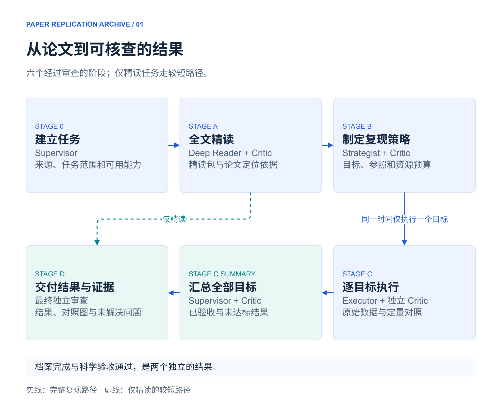
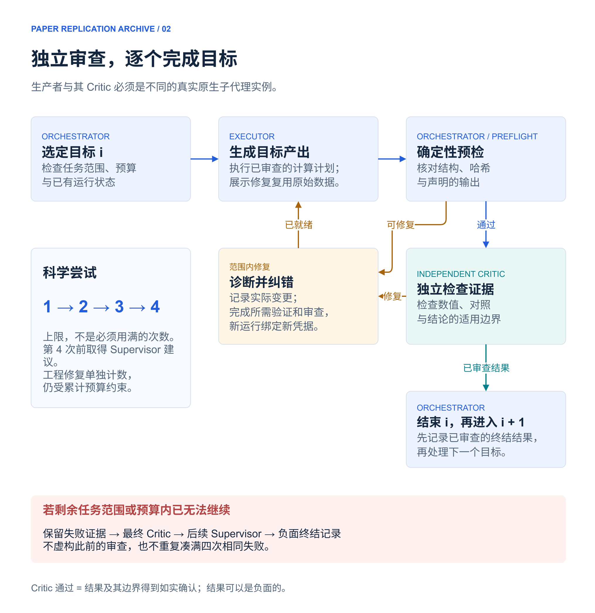
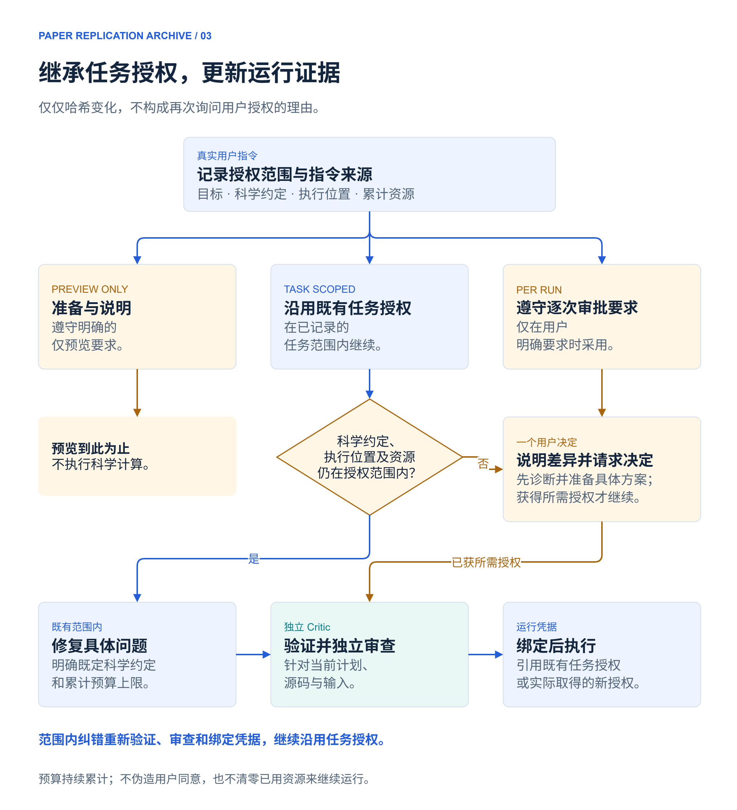
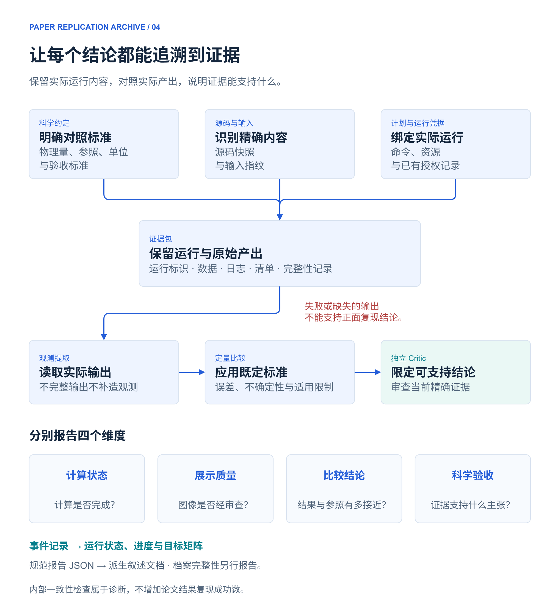

# Paper Replication Archive 中文指南

**读懂论文，复现结果，保留证据。**

[English](README.md) · [安装](#install) · [开始使用](#use) · [实际示例](#example) · [v5.0.0 下载](https://github.com/omegawork/paper-replication-archive/releases/tag/v5.0.0)

[](https://github.com/omegawork/paper-replication-archive/actions/workflows/ci.yml)

Paper Replication Archive 是面向研究者的通用 [Agent Skill](https://agentskills.io/specification)，帮助 AI Agent 精读论文并复现科学结果。它把每个目标与科学约定、代码实现、原始产出、定量对照和独立审查关联起来。

常规修复沿用既有任务授权继续推进；科学假设和验收标准保持明确，未完成或未达标的结果会如实出现在最终交付中。

| 你提供什么 | 流程产出什么 |
|---|---|
| 论文文件或可访问的来源，以及精读或复现目标 | 含公式、图意、参数、主张与原文定位依据的精读包 |
| 指定图表、固定科学约定、执行位置和资源预算 | 已审查的目标计划、可核查的运行记录、原始结果与定量对照 |
| 继续已有任务时提供原档案目录 | 当前状态、保留的失败证据、经过审查的结论与可读档案 |

**运行条件：** Python 3.10+、文件与命令工具。Skill 自带工具只使用 Python 标准库；论文实现本身可能需要其他依赖。完整流程还要求宿主具备**真实独立原生子代理**。没有此能力的宿主可辅助阅读、准备任务或检查已有档案，详见[兼容范围](#compatibility)。

## 目录

- [安装](#install)与[开始使用](#use)
- [六阶段完整流程](#workflow)
- [独立审查与科学尝试](#review)
- [授权、修复与中断恢复](#authorization)
- [证据与结果解读](#evidence)
- [已完成的合成示例](#example)
- [进阶命令、记录与宿主适配](#advanced)
- [验证与贡献](#validation)

<a id="install"></a>
## 安装

### 从版本标签安装

```text
git clone --branch v5.0.0 https://github.com/omegawork/paper-replication-archive.git
cd paper-replication-archive
python scripts/install_skill.py --action update --source . --target "/path/to/agent/skills/paper-replication-archive"
python scripts/install_skill.py --action check --source . --target "/path/to/agent/skills/paper-replication-archive"
```

将目标替换为所用 Agent 实际加载的技能目录，路径含空格时保留引号。如果系统使用 `python3`，将命令中的 `python` 替换为 `python3`。省略 `--target` 时，安装器使用 `$CODEX_HOME/skills/paper-replication-archive`；未设置该变量时使用 `~/.codex/skills/paper-replication-archive`。

### 从 Release 安装包安装

1. 从 [Release](https://github.com/omegawork/paper-replication-archive/releases/tag/v5.0.0) 下载 `paper-replication-archive-5.0.0.zip` 和 `SHA256SUMS.txt`。
2. 核对 ZIP 的 SHA-256 与公布值一致。PowerShell 可使用 `Get-FileHash`，Linux 使用 `sha256sum`，macOS 使用 `shasum -a 256`。
3. 解压并进入顶层目录，执行上面相同的 `install_skill.py` 安装与检查命令。

也可以手动复制完整的 `skills/paper-replication-archive/` 目录，保留脚本、schema 与参考协议。入口是 [SKILL.md](skills/paper-replication-archive/SKILL.md)。受管理的逐文件检查需要通过安装器建立清单。

安装器会拒绝覆盖无法识别的本地修改。如果已经改过旧版，先保留备份、比较并合并有意修改，再安装到新目录；没有强制覆盖选项。按宿主要求重新加载技能。文件一致不代表正在运行的 Agent 已经加载新版。

<a id="use"></a>
## 开始使用

让 Agent 加载 Skill 后，直接描述任务即可。正常使用不要求你手动操作底层运行命令。

| 目标 | 示例请求 |
|---|---|
| 全文精读 | “使用 $paper-replication-archive 精读 `<论文>`，解释模型、关键推导、图表、假设与局限，并给出原文定位依据。” |
| 完整复现 | “使用 $paper-replication-archive 复现 `<论文>` 的全部数据图，在本地 `<资源预算>` 内执行，分别报告每个目标的验收情况。” |
| 指定目标 | “使用 $paper-replication-archive 复现 `<论文>` 中的 Fig.3 和 Table 1，保持论文的归一化与边界条件。” |
| 仅预览 | “为 `<论文>` 准备复现策略、依赖、命令和预算。仅预览，不执行科学计算。” |
| 恢复已有任务 | “在既有范围内继续 `<档案目录>` 的任务。先检查当前运行与证据，保留已有结果，避免重复启动计算。” |

可访问的论文和明确目标是起点。有重要限制时一并提供：Hamiltonian／模型、几何结构、指标约定、单位、固定参数、执行主机，以及累计时间、磁盘和运行次数预算。Agent 应先从论文和环境中查明缺失信息，只有尚未解决的选择会改变科学含义或授权范围时才询问。预算不意味着允许无限重试。

<a id="workflow"></a>
## 六阶段完整流程

[](docs/diagrams/workflow-overview-zh.drawio.svg)

[可编辑 SVG](docs/diagrams/workflow-overview-zh.drawio.svg) · [全部图稿与编辑说明](docs/diagrams/README.md)

**图例：** 蓝色表示流程与证据，青绿色表示独立审查与报告，琥珀色表示决定与修复，淡红色表示负面终结。

| 阶段 | 职责与输入 | 主要产物 | 完成条件 |
|---|---|---|---|
| **Stage0 — 建立任务** | Orchestrator 与 Supervisor 检查用户目标、来源和可用能力 | 来源与预检查记录、任务模式、范围边界 | 真实 Supervisor 完成并通过启动审查 |
| **StageA — 全文精读** | Deep Reader 理解论文及目标所依赖的定义与约定 | 精读包、公式／图／参数／主张登记及原文定位 | 确定性预检和独立精读 Critic 通过 |
| **StageB — 制定策略** | Strategist 将科学定义落实到方法、参照、代码和预算 | 目标矩阵、小规模与代表性验证策略、具体计划、审查后的运行绑定 | 策略预检和独立 Critic 通过，执行策略允许继续 |
| **StageC — 逐目标执行** | 每次由一位 Executor 在既有范围内执行一个目标 | 运行记录、原始数据、比较、图像和目标级审查 | 全部目标形成已审查的终结结果；目标及汇总检查通过，必要时采用已验证的负面终结 |
| **StageCSummary — 汇总评估** | Supervisor 汇总已验收、失败、阻塞和未解决结果 | 如实说明实际工作、对照结果和剩余缺口的摘要 | 摘要预检和独立 Critic 通过 |
| **StageD — 交付** | 根据当前证据组织档案并接受最终独立审查 | 实际结果、对照图、允许主张和可读档案 | 最终独立审查通过；档案完整性与科学验收分别报告 |

仅精读任务走 **Stage0 → StageA → StageD**，正式流程仍保留独立审查。仅预览任务可准备并说明计划，但不能进入 StageC 执行。

大规模扫描前，先检查依赖、可信的小规模基线和预算内的代表性规模，并测试正式运行会采用的序列化与延续路径。共享基础设施故障应先集中诊断，避免对整批目标重复触发同一问题。

<a id="review"></a>
## 独立审查与科学尝试

[](docs/diagrams/independent-review-zh.drawio.svg)

Orchestrator 负责协调和记录控制器事件。生产者产出科学内容，其 Critic 必须是另一位真实原生子代理，并登记平台实际返回的身份。主代理自写“Critic 报告”，或者启动第二个 CLI 进程，都不构成真实原生独立审查。

普通结构预检失败时，先诊断修复，再进行正常结果审查。范围或预算内已无法推进时，由真实最终 Critic 审查失败证据，再由后续 Supervisor 审查负面终结；不得为了填满模板而虚构此前的 Critic 记录。

**每目标最多四次科学尝试，这是上限，不是必须走完的次数。** 第四次前需要已完成的 Supervisor 建议。环境、传输、格式和展示修复单独计数，其资源消耗仍受累计预算限制。没有实际变更或新的修复证据时，不重复执行同一个失败计划。

Critic 的 `pass` 表示结果及其边界得到了如实确认；经过审查的结果可以是负面的。失败记录通过审查，不会变成正面复现结论。

<a id="authorization"></a>
## 授权、修复与中断恢复

[](docs/diagrams/authorization-and-repair-zh.drawio.svg)

授权与运行证据回答不同问题：**任务范围记录用户允许做什么，运行凭据标明本次究竟审查了什么、将执行什么。** 修复实现后，可以继续沿用原范围，为变化后的计划、源码或输入生成新的审查和运行绑定。

| 情况 | 应有行为 |
|---|---|
| 任务环境中的依赖声明有误 | 在既定环境与预算内诊断修复，验证后继续 |
| 代码索引或参数拼写错误 | 修正实现，使其符合原科学约定；完成所需验证、审查和新绑定 |
| 预览后源码哈希变化 | 停用过期运行凭据，检查变更并重新绑定已审查证据；不能仅因哈希变化而要求用户重新批准 |
| 图例或排版存在缺陷 | 复用有哈希记录的数值输出进行展示修复，保留数值证据和科学尝试计数 |
| Agent 长时间没有聊天输出，或会话中断 | 检查实际 worker、进程、调度状态和原运行标识；聊天安静不等于计算超时 |
| 输出目录已经存在 | 先检查并保留；再次打开同一证据包只观察或重新验证，不重复启动计算 |
| 结果未达到标准，或已无法继续 | 保留证据，完成相应独立审查，如实报告负面或未解决结果 |
| 下一步改变科学约定、位置、能力范围或资源上限 | 先完成诊断，说明具体差异，再提出所需的一个决定 |

明确的 `preview_only` 和用户要求的 `per_run` 仍然有效。缺少授权，或宿主权限无法在已有授权内满足时，也需要先解决实际阻碍。论文、仓库中的指令或代理生成的批准文件不能代替用户的真实决定。

恢复前先检查：本地进程仍在运行时继续观察；外部任务是否结束不明确时，获取真实进程或调度证据。只有相关运行结束得到确认后才恢复。恢复保留原始文件，不重新启动计算；已经封存的运行可补齐中断的资源记账而不改变证据包。详见[证据运行协议](skills/paper-replication-archive/references/evidence_runtime_protocol.md)。

<a id="evidence"></a>
## 证据与结果解读

[](docs/diagrams/evidence-to-claims-zh.drawio.svg)

档案保留论文主张与相应代码、数据、评估之间的关联。清单与哈希使内容变化可被发现，但不能认证用户同意、认证审查身份，或证明科学正确性。

| 维度 | 回答的问题 | 单凭它不能说明什么 |
|---|---|---|
| **计算状态** | 命令完成、失败，还是仍在运行？ | 返回码为零，不代表与论文结果一致 |
| **展示质量** | 图像是否经过可读性和展示正确性检查？ | 图画得漂亮，不代表数值已验收 |
| **比较结论** | 观测与指定参照、标准相比如何？ | 比较仍需要正确的单位、约定、来源和不确定性 |
| **科学验收** | 当前已验证证据能够支持什么结论？ | 失败、损坏或证据不足的结果不能升级为正面主张 |

**档案完整性是独立的交付结果。** 最终答复应先展示实际结果、对照文件、误差和未解决问题。内部恒等式与诊断测试不增加论文复现成功数。数字化参照数据需要坐标标定、误差与真实独立审查；单凭截图不构成定量证据。

<a id="example"></a>
## 已完成的合成示例

[原创两能级案例](examples/synthetic-paper.md) 使用 `H(λ) = [[λ, 1], [1, −λ]]`，下支本征值为 `E₀ = −√(1 + λ²)`。它是软件验证示例，并非已发表论文。

[](examples/native-validation/README.md)

| λ | 实测 E₀ | 与给定参照值的绝对差 |
|---:|---:|---:|
| 0 | −1.0 | 0 |
| 0.5 | −1.118033988749895 | 0 |
| 1 | −1.4142135623730951 | 0 |

验收阈值固定为 **1e−12**。零差异针对给定十进制参照值的 binary64 表示，不代表实数运算不存在舍入误差。曲线使用 201 个直接计算的绘图点，定量比较使用三个准确的参数行。

独立进行的 Codex 原生验收中，**10 个真实实例完成六个阶段**，独立审查通过。只有一次科学运行、一份继承授权，没有额外授权问题；两项工程适配未增加科学尝试。重开证据包时，18 个文件和预算账本保持不变。11 项内部诊断不增加复现成功数。最终 50 条事件审计没有状态视图差异。

[观测数据](examples/native-validation/observed.json) · [矢量结果图](examples/native-validation/fig1.svg) · [验证范围](docs/v5-audit.md)

公开示例是导出的结果，不是可独立验证的完整证据包；其中不包含私人指令、原生代理身份或会话日志。这些记录验证了有限的合成案例与已测试宿主行为，不能推广为对研究论文的普遍复现成功承诺。

<a id="advanced"></a>
## 进阶参考

<details>
<summary><strong>常用命令：查看、验证、恢复与导出</strong></summary>

在仓库根目录执行下列命令，将 `/path/to/...` 替换为真实路径；使用已安装 Skill 时改为其 `scripts/` 位置。状态、审计与验证用于检查已有证据；恢复与渲染会更新相应记录或派生视图。

```text
python skills/paper-replication-archive/scripts/runtime_control.py status /path/to/case
python skills/paper-replication-archive/scripts/runtime_control.py audit-case /path/to/case
python skills/paper-replication-archive/scripts/evidence_runtime.py status --bundle /path/to/bundle
python skills/paper-replication-archive/scripts/evidence_runtime.py verify --bundle /path/to/bundle
python skills/paper-replication-archive/scripts/evidence_runtime.py recover --bundle /path/to/bundle
python skills/paper-replication-archive/scripts/runtime_control.py export-case /path/to/case --destination /path/to/new-export
```

检查已有进程或外部运行后才使用 `recover`。不确定的运行标识需要实际结束证据，而不是新的授权表单。需要显式刷新叙述文档时使用 `render-case`；最终交付前使用 `build-final-claims` 重新验证选定证据。完整选项见各工具的 `--help`。

</details>

<details>
<summary><strong>档案目录与记录归属</strong></summary>

| 相对档案根目录的位置 | 用途与归属 |
|---|---|
| `reference/` | 论文来源、处理后材料与可获得的作者数据 |
| `code/`、`results/` | 实现代码与逐目标运行证据 |
| `logs/runtime_events.jsonl` | 通过 Orchestrator／控制器写入的哈希链动态事件记录 |
| `work/runtime_state.json`、代理登记与目标矩阵 | 从运行事件生成的状态投影 |
| `stage_gates/` | 预检报告与真实独立审查材料 |
| `reports/` | 进度、完成证据、汇总与最终允许主张 |
| `to_obsidian/` | 可读最终档案；使用这些 Markdown 不要求安装 Obsidian |

修改规范报告输入，再生成受影响的派生内容：

| 规范输入 | 生成的输出 |
|---|---|
| `work/deep_reading_pack.json` | `01_deep_reading/` 下的精读包 |
| `reports/stage_c_summary.json` | `reports/stage_c_summary.md` |
| `work/archive.json` | `to_obsidian/Paper_Reproduction_Archive.md` |

普通状态事件不重写全部叙述报告。目标定义通过 `define-targets` 导入，后续动态字段来自控制器事件。不得为了通过关卡而手改事件链或派生状态。详见[编排协议](skills/paper-replication-archive/references/orchestrator_protocol.md)和[阶段关卡](skills/paper-replication-archive/references/gate_state_machine_protocol.md)。

</details>

<details>
<summary><strong>任务授权、运行凭据与独立审查绑定</strong></summary>

授权范围记录实际指令及其来源、允许的目标、科学约定、执行位置、能力和累计限额。资源账本在执行前预留预算，并根据终结证据结算；替换计划不能重置资源账本。

运行凭据把已审查的具体计划绑定到授权。执行审查记录不同的生产者与审查者实例，以及当前计划、源码哈希；计划包含输入哈希。目标最终审查绑定当前数值证据包清单，展示审查绑定实际的原数值包或派生图像包。过期审查、其他目标的审查不能关闭当前目标。

执行接口保留 `--approval` 参数名；正常的任务范围授权流程传入的是已绑定的运行凭据。`record-scope` 记录已有许可，不创造新的用户同意。显式 `approve` 只用于真实取得的、用户要求的逐次运行决定。

详见[授权规则](skills/paper-replication-archive/references/user_interaction_protocol.md)、[执行与绑定](skills/paper-replication-archive/references/evidence_runtime_protocol.md)、[串行执行](skills/paper-replication-archive/references/stage_c_serial_executor_protocol.md)和 [schemas](skills/paper-replication-archive/schemas/)。

</details>

<a id="compatibility"></a>
<details>
<summary><strong>Agent 兼容、报告语言与 v4 档案</strong></summary>

| 宿主能力 | 支持的用途 | 实际验证边界 |
|---|---|---|
| 真实独立子代理、Python、文件与命令工具 | 完整正式流程 | 已在 Windows／Python 3.10.9 的 Codex 中完成原生合成验收 |
| 能加载 Skill 并运行 Python，但没有原生子代理 | 阅读辅助、准备、已有档案检查与导出 | 不能宣称完成正式独立流程 |
| 纯文本 Agent | 阅读说明、辅助制定计划 | 不能运行或验证档案工具 |

入口遵循 Agent Skills 目录结构并使用相对资源，不强制调用 Codex 专有 API；`agents/openai.yaml` 只是可选界面元数据。宿主适配应将真实创建、状态、完成和身份依据映射到协议角色。不得用模拟身份或仅设置能力标志绕过关卡。其他宿主的原生行为仍需实际测试后才能宣称已验证。

新案例支持 `init-case --language en` 和 `--language zh-CN`。报告内容使用选择的语言，schema 字段保持稳定。语言质量按实际表达检查，不用字符比例作为门槛。

v4 档案保留只读状态、审计、证据验证和原样导出。审计可以报告历史差异，而不重写旧事件或提升旧主张。不会自动迁移科研档案。详见[安装与历史兼容](skills/paper-replication-archive/references/migration_installation_protocol.md)。

</details>

<a id="validation"></a>
## 验证与贡献

v5.0.0 的 **83 项测试在 Windows／Linux／macOS × Python 3.10／3.14 六组环境中全部通过**，包括打包与全新安装检查。真实原生验收与使用明确测试替身的单元测试分开进行。[发布标签 CI](https://github.com/omegawork/paper-replication-archive/actions/runs/34876696880) · [审查与限制](docs/v5-audit.md)。

```text
python -B -m unittest discover -s tests -v
python skills/paper-replication-archive/scripts/lint_skill.py
python scripts/package_release.py --output dist
```

源码快照不构成安全沙箱，执行仍使用宿主控制。本地子进程墙钟时间会被限制，磁盘在运行后检查；计划标为 advisory 的内存、网络和 GPU 约束需要宿主提供实际控制。

反馈问题和贡献时请使用合成示例，不上传凭据、私人会话、未获授权的科研数据或第三方论文 PDF。见 [CONTRIBUTING.md](CONTRIBUTING.md)。项目采用 [MIT 许可证](LICENSE)。
