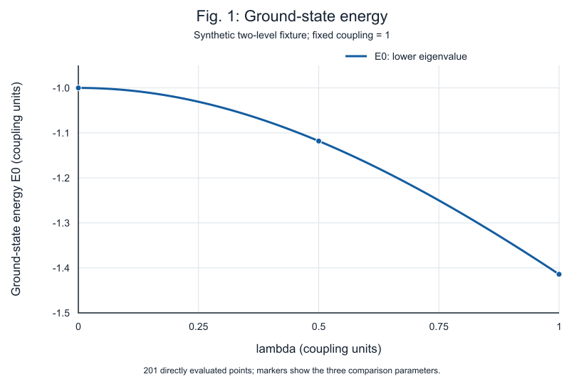

# Synthetic result example

These are unchanged numerical and figure outputs from the independent native-agent
evaluation of [the original two-level fixture](../synthetic-paper.md). They contain
no published-paper material, research data or private conversation content.

- [Observed values](observed.json): three rows at lambda = 0, 0.5 and 1.
- [Original vector figure](fig1.svg): 201 directly evaluated points, without interpolation.
- [Review image](fig1.png): offline raster of the original SVG, used for actual visual inspection.

Maximum absolute difference from the specified binary64 reference values was zero,
within the fixed 1e-12 criterion. This does not assert zero real-arithmetic roundoff.
The plotted line is a synthetic two-level result, not a reproduced published figure.

These exported results are not a standalone Evidence Bundle. Execution metadata,
authorization sources and native-agent records remain in the private validation
case. See the [release audit](../../docs/v5-audit.md) for the validation scope.
